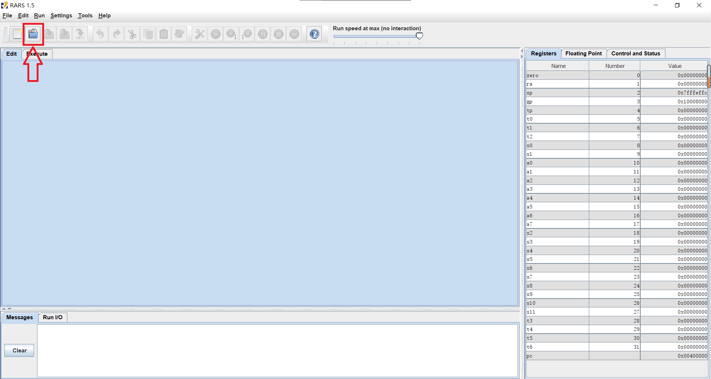
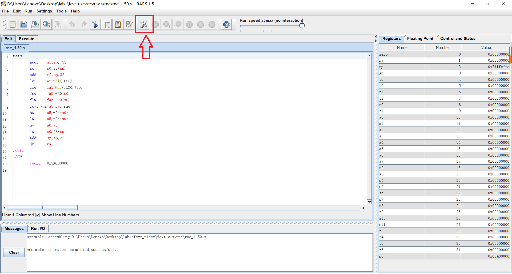
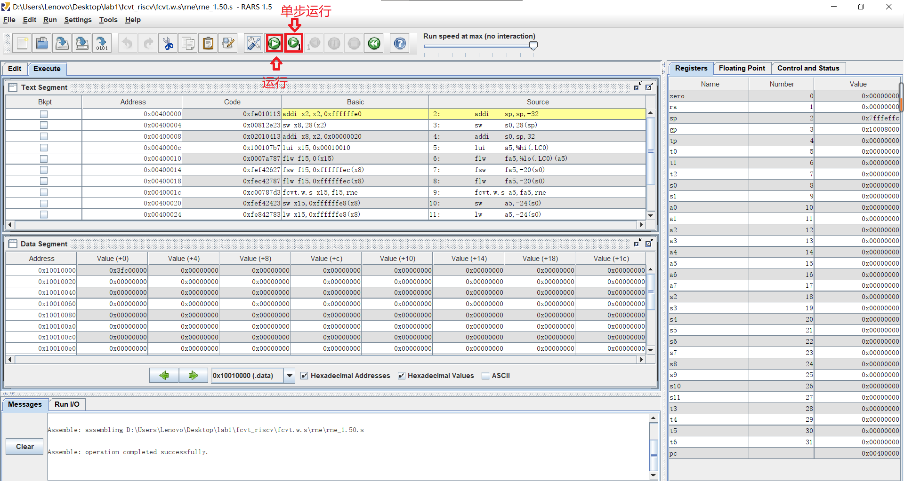

- this is the source code to test `fcvt.s.w` and `fcvt.w.s` instructions of RISC-V
- 本实验采用rars模拟器，该模拟器基于java，需要配置至少Java 8环境，可以在windows以及java平台下运行

- 使用过程

  - 解压后在当前目录，在bash或cmd中运行`java -jar rars_27a7c1f.jar`命令，之后将会出现软件的界面

  
             
open the software
 

  - 然后点击上方箭头所指位置打开文件选择框
  - 打开后按下方图片所示按钮进行汇编程序的编译

  
             
assemblying the source code
 

  - 按照下方所示图片进行调试

  
             
debug
 

