# fcvt -- Riscv下浮点数转换的round问题

## 一. 背景介绍(说明)

从大一刚开始接触编程，在第一门C语言中，我们就了解到了不同的数据类型，每种数据类型有其对应的储存的长度，包括sign与unsign都需要指明，同时我们也学到了类型的转换。例如在Java中，由float类型转为int型变量是可以进行自动转换的，但是对于int型转为float型则需要强制类型转换，否则将会报错。当后来学习了数字逻辑设计以及计算机组成之后对于数据在计算机内的储存有了更为清晰的认知，但同时也产生了新的疑惑，在我们进行数据类型的转换的时候在CPU上是如何进行的呢？在学完计组之前我的猜测是这一部分可能是在软件层面进行处理的，但是在学习计组的过程中我在RISC-V的reference上看到了相关的指令，才发现浮点数转化是有专门的指令来进行操作，当时也没有进行进一步的探究，仅仅是停留在知道这个指令以及它的格式的状态。

但是在这一次探索实验布置之后，我第一个想到的就是它，因为在之前的课程中没有讲到相关的指令，更没有讲到关于CPU中如何实现浮点到整数的转化，仅仅只涉及到了浮点数的加和乘。在进行初步的测试中我观察到了如下的指令

```c
int round(int num) {
    float a = num;
    int b = num;
    return b;
}
```

上述的代码对一个输入的整形变量进行类型转换并赋值给a，然后再将a转换为整数类型并返回。

由``RISC-V rv64gc gcc 12.2.0`进行编译，得到的汇编程序如下

```assembly
round(int):
        addi    sp,sp,-48
        sd      s0,40(sp)
        addi    s0,sp,48
        mv      a5,a0
        sw      a5,-36(s0)
        lw      a5,-36(s0)
        fcvt.s.w        fa5,a5 #将一个储存在a5中的整型变量转化为浮点类型的变量并储存到fa5中	
        fsw     fa5,-20(s0)
        flw     fa5,-20(s0)
        fcvt.w.s a5,fa5,rtz	#将浮点数转化为相应的整型变量，但是rtz不知道是什么含义
        sext.w  a5,a5
        mv      a0,a5
        ld      s0,40(sp)
        addi    sp,sp,48
        jr      ra
```

上面的asm代码中，我们看到在使用`fcvt.s.w`将整型转化为浮点型变量时，指令正常，但是在使用`fcvt.w.s`将浮点型转化为整型变量时，却出现了第三个操作数，相应的我对此进行了探索。

## 二. 分析与猜想(探索过程第一步)

对于上述中的代码，我使用同样的源代码和编译器，但是添加了`-O3`编译选项，对代码进行优化，得到如下的汇编程序。

```assembly
round(int):
        fcvt.s.w        fa5,a0 	# float a = num;
        fcvt.w.s a0,fa5,rtz		# int b = a;
        sext.w  a0,a0			# addiw a0, a0, 0 对a0进行signed extension
        ret						# return b;
```

首先我们可以看到在进行优化之后的代码大大缩短，显得更加简洁，不像之前的那么臃肿，这也让我体会到了编译器的强大。由上述代码我们可以很清晰地看到在相互的转化中在`fcvt.w.s`中多了一个`rtz`操作数，从这里我开始思考这两条指令地区别是什么呢？由此我回想起在计算机组成中学到的关于浮点数储存格式的问题。

<center>    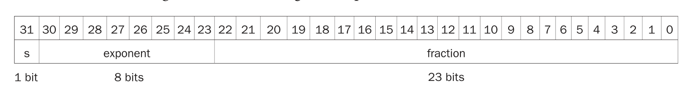    <br>    <div style="color:orange; border-bottom: 1px solid #d9d9d9;    display: inline-block;    color: #999;    padding: 2px;">single floating-point format[1]</div> </center>

<center>    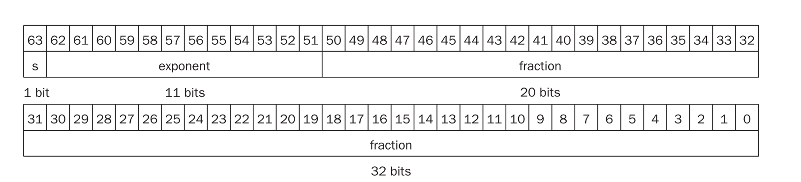    <br>    <div style="color:orange; border-bottom: 1px solid #d9d9d9;    display: inline-block;    color: #999;    padding: 2px;">double floating-point format[1]</div> </center>

上面给出了单精度数以及双精度数由IEEE 754定义的标准格式，但是由此也就引发了两个问题。

1. 在浮点数转化为整型数时，由于有小数，因此在转化为整型的时候我们必须要考虑round的问题，但是同时我们在计算机组成中学到了对于同一个浮点数，运用不同的round的规则会得到不同的结果，但是在整型到浮点型的过程中不会存在round的问题。同样的问题也会出现在由double浮点数向single浮点数转化的过程中。

2. 尽管在人类的理解中整型到浮点型的过程不会有round的过程，只需要舍弃相应的小数即可，但是这里面其实有更加深层次的问题。

   > 在这里我希望能更加清晰地阐明我的想法，对于一个二进制的固定位数的数，其所能标识的数的总数为固定的数。我们平时所说的源码，反码，补码，实际上他们所能表示的数字的个数是相同的，指示表示的范围不同而已。
   >
   > 因此，对于同样是32为的整型变量和单精度浮点数来说，他们所能表示的数的个数还是一样的，只不过一个表示的是整数，一个表示的是浮点数。但是同时我们知道，一个32位的无符号整型变量的取值范围为$\{0,2^{32}-1\}$,但是对于32位的单精度浮点数来说它的取值范围则大得多，为${-3.4E38～3.4E38}$，这一范围比整型变量大得多，同时单精度浮点数还需要表示众多的小数，因此单精度浮点数必然不能表示一部分整数，而事实也确实如此。
   >
   > <center>    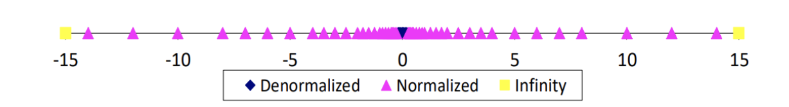    <br>    <div style="color:orange; border-bottom: 1px solid #d9d9d9;    display: inline-block;    color: #999;    padding: 2px;">The limit of floating-point number[2]</div> </center>
   >
   > 由上图可知，在数比较小的时候，表示的浮点数比较密集，在数逐渐变大的过程中，表示的浮点数逐渐变得稀疏。可以简单进行一个解释，对于$(-1)^S \times F\times 2^E$, 在E比较小的时候，同样的F变化对于最后的数字影响较小，但是当E变大的时候，同样的F变化会导致最终的数字的变化更大。知道某一个节点，即使F发生一个最小的变化（fraction部分加1），但是乘上$2^E$后仍然大于一，因此就会导致直接跳过当前那个数字。
   
   经过上面的阐述之后，我们可以提出第二个问题了，当一个比较大的整型变量转化为浮点型变量时，如果恰好为浮点数无法表示的那个整数，那么应该如何进行转化呢？

提出问题之后，需要进行解决方案的猜想

对于第一个问题，我猜测上述汇编指令所给的那个`rtz`就是用来指定round的类型，但是对于其工作的原理还需要进一步探究，这方面需要查询riscv的相关手册

对于第二个问题，为了简化内容，我们假设是将无符号整数转化为单精度浮点数（实际上对于有符号数，我们只需要检测最高位，判断正负，然后取补码得到相应的正整数，即可转化为无符号正整数），对于32位的正整数，我想CPU会先检测最高位的1的index，然后得到指数，随后就同样是一个round的问题，因为除去指数之后，原本的正整数变成了$1.\times\times\times...$的形式，一次如果后面超过23位的话，需要舍弃一些位。

## 三. 验证浮点数转化为正整数 -- `fcvt.w.s`的round问题(探索过程第二步)

### 1. 查找命令信息

首先我查询了riscv的相关手册，找到了关于rounding mode的相关信息，如下图

<center>    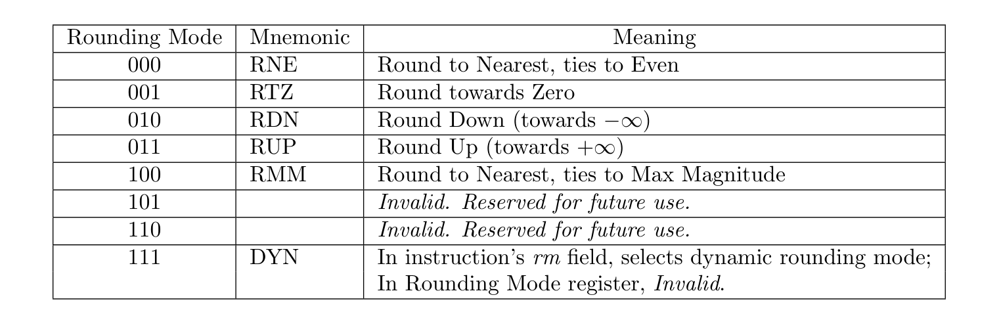    <br>    <div style="color:orange; border-bottom: 1px solid #d9d9d9;    display: inline-block;    color: #999;    padding: 2px;">rounding mode encoding</div> </center>

接着查找了fcvt的指令格式，可以得知`fcvt.w.s`中[12:14]为frm位，由此我们已经了解了相关的必要信息，接下来开始进行验证。

<center>    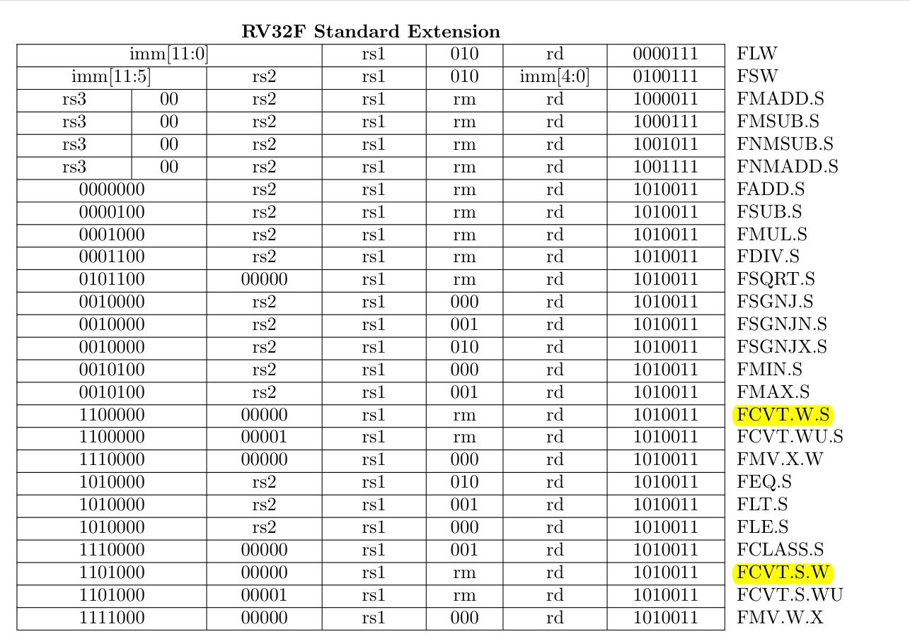    <br>    <div style="color:orange; border-bottom: 1px solid #d9d9d9;    display: inline-block;    color: #999;    padding: 2px;">rv32 floating-point instructions[3]</div> </center>

### 2. 验证方式

接着我将上面编译生成的源码放到汇编器[venus](https://venus.cs61c.org)中，但是在这个过程中，我发现汇编器会对编译出的指令报错如下

<center>    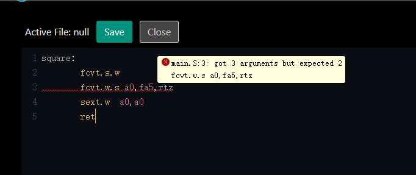    <br>    <div style="color:orange; border-bottom: 1px solid #d9d9d9;    display: inline-block;    color: #999;    padding: 2px;">assembler error</div> </center>

这说明汇编器不认识这一条指令，也即是说不会直接识别rtz标识。那么可能有以下两种情况，一种是当前的汇编器不支持带有rtz的fcvt.w.s，另一种是rtz标识需要在后续的其他环节处理，但是由riscv对fcvt类型指令设置了专门的frm field，因此更有可能是当前的汇编器不支持，因此我寻找了其他的模拟器进行测试，在这里我首先寻找了[rars](https://github.com/TheThirdOne/rars)这一模拟器并将上述的指令加载进入模拟器并成功生成二进制指令，这说明上述指令并没有问题，只是之前的venus并不支持相应的frm标识。然后观察在执行相应的命令之后会如何round以及round的结果。

## 四. 验证正整数转化为浮点数 -- `fcvt.s.w`的无法对应问题(探索过程第二步)

### 1. 命令信息

由三中的图可知，`fcvt.s.w`指令同样拥有frm filed，因此进一步印证了我们之前的猜测，对于无符号正整数转化为浮点数，同样可以归结于round问题，当然我们还没有进行实际的测试，因此仍然需要进一步的测试来证实当前的猜想。

### 2. 测试方式

通过riscv架构的模拟器，在写好汇编代码之后，在模拟器中运行，观察运行结果是否符合预期。

## 五. 测试用例及结果(探索过程第三步)

### 5.1 fcvt.s.w测试

这一部分我们通过设置不同的测试用例来观察不同frm的fcvt.s.w会如何进行round

#### 5.1.1 RNE -- 000 Round to Nearest, ties to Even

分析：

1. 小数部分为以0开头的都需要舍弃
2. 以1开头且后面不为0的进1
3. 以1开头且后面全为0的，由于整数部分必为1，则相应的需要进位

总结就是看小数部分第一位，如果为0则舍弃，如果为1则进位

##### 5.1.1.1 number -- 1.25	`0b1.01`

<center>    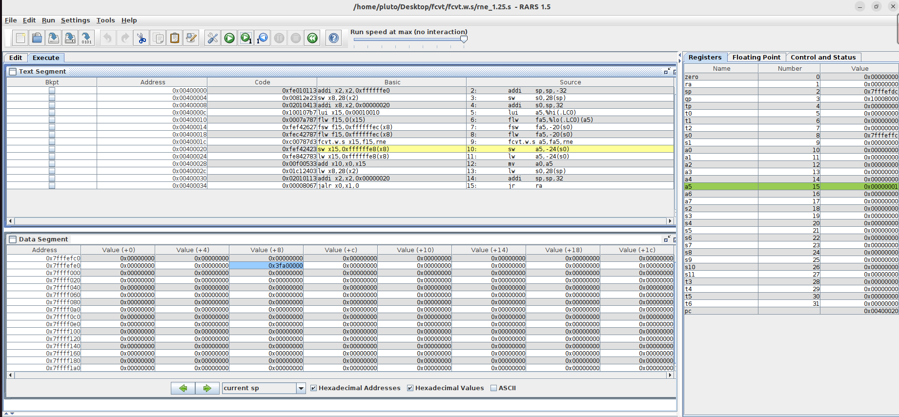    <br>    <div style="color:orange; border-bottom: 1px solid #d9d9d9;    display: inline-block;    color: #999;    padding: 2px;">RNE_1.25</div> </center>

##### 5.1.1.2 number -- 1.5	`0b1.10`

<center>    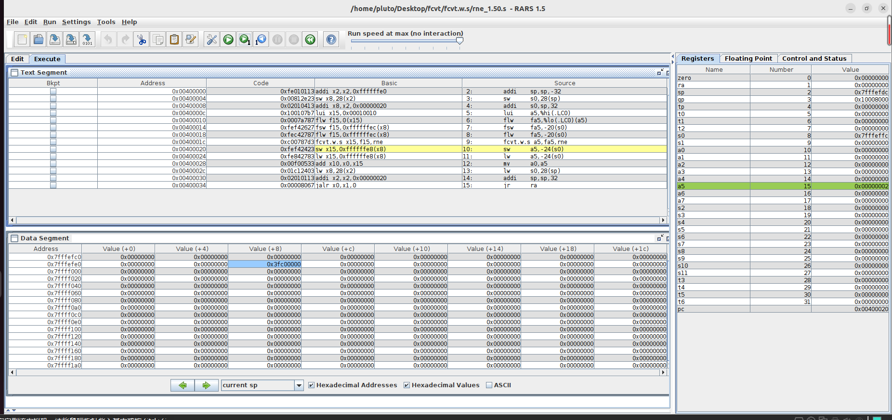    <br>    <div style="color:orange; border-bottom: 1px solid #d9d9d9;    display: inline-block;    color: #999;    padding: 2px;">RNE_1.50</div> </center>

##### 5.1.1.3 number -- 1.75	`0b1.11`

<center>    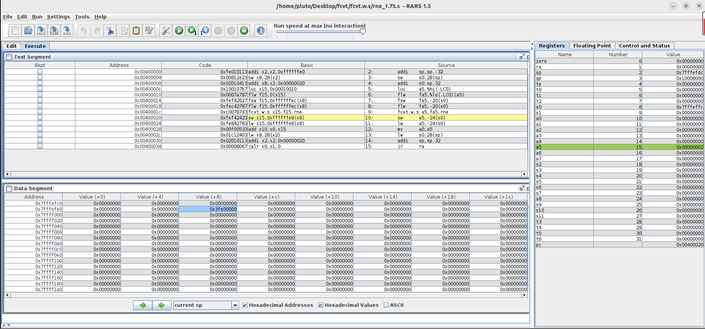    <br>    <div style="color:orange; border-bottom: 1px solid #d9d9d9;    display: inline-block;    color: #999;    padding: 2px;">RNE_1.75</div> </center>

##### 5.1.1.4 number -- 10.25 	`0b1010.01`

<center>    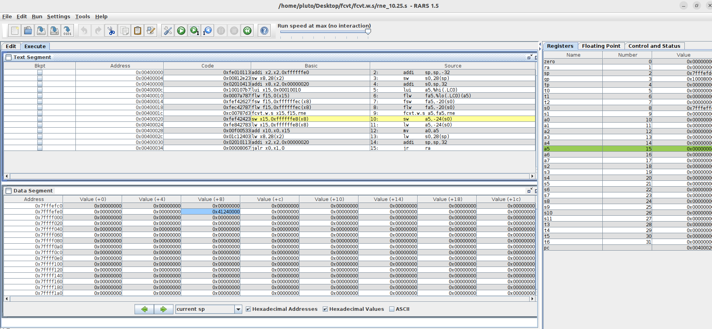    <br>    <div style="color:orange; border-bottom: 1px solid #d9d9d9;    display: inline-block;    color: #999;    padding: 2px;">RNE_10.25</div> </center>

##### 5.1.1.5 number -- 10.50	`0b1010.10`

<center>        <br>    <div style="color:orange; border-bottom: 1px solid #d9d9d9;    display: inline-block;    color: #999;    padding: 2px;">RNE_10.50</div> </center>

##### 5.1.1.6 number -- 100.5	`0b 0110_0101.10`

<center>    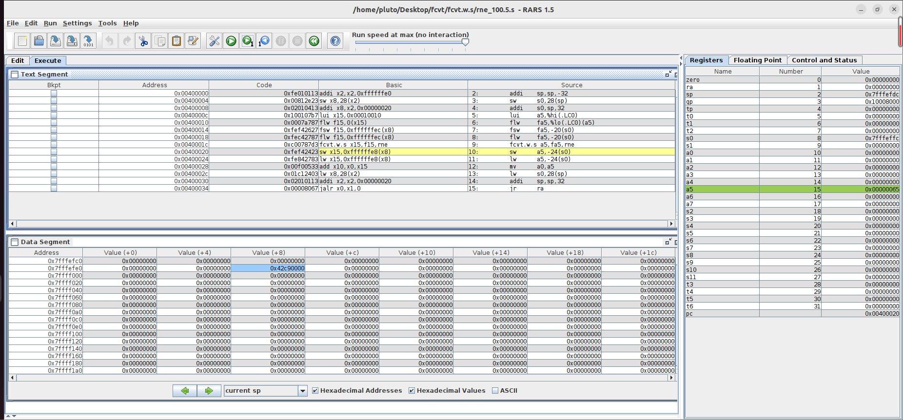    <br>    <div style="color:orange; border-bottom: 1px solid #d9d9d9;    display: inline-block;    color: #999;    padding: 2px;">RNE_100.5</div> </center>

用例解释，由于不确定CPU是以二进制进行round还是以十进制进行round，因此我设置了10.5，100.5两个用例，如果是以十进制则这两个都是会舍弃，以二进制则两个都会进位，结果证明两个都产生了进位，因此说明是以二进制进行rounding。

##### 5.1.1.7 number -- -1.25	`-0b1.01`

<center>    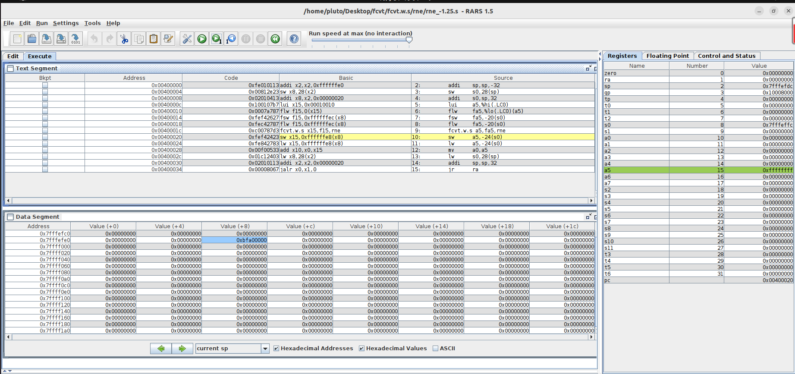    <br>    <div style="color:orange; border-bottom: 1px solid #d9d9d9;    display: inline-block;    color: #999;    padding: 2px;">RNE_-1.25</div> </center>

##### 5.1.1.8 number -- -1.50	`-0b1.10`

<center>    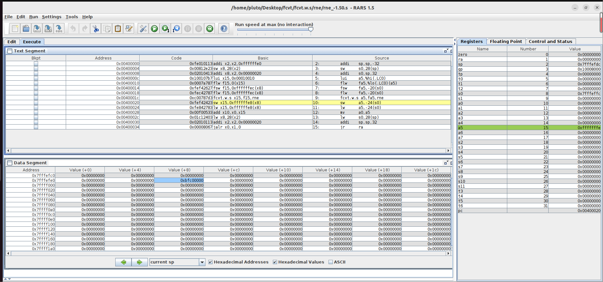    <br>    <div style="color:orange; border-bottom: 1px solid #d9d9d9;    display: inline-block;    color: #999;    padding: 2px;">RNE_-1.50</div> </center>

##### 5.1.1.9 number -- -1.75	`-0b1.11`

<center>    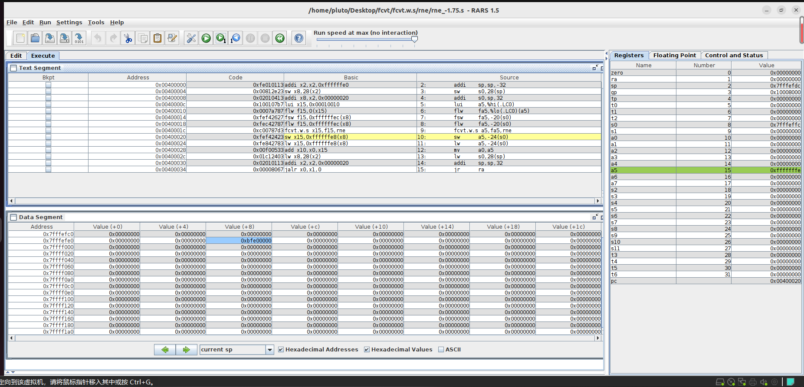    <br>    <div style="color:orange; border-bottom: 1px solid #d9d9d9;    display: inline-block;    color: #999;    padding: 2px;">RNE_-1.75</div> </center>

由上述负数测试用例可知，对于负数可以理解为先取绝对值进行round，然后再加上符号

##### 5.1.1.10 number -- 2.50	`0b10.1`

<center>    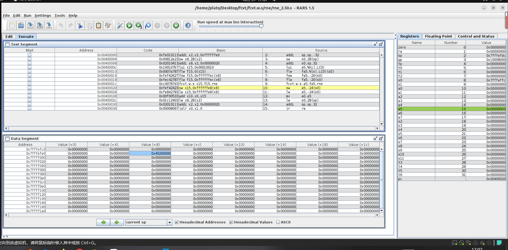    <br>    <div style="color:orange; border-bottom: 1px solid #d9d9d9;    display: inline-block;    color: #999;    padding: 2px;">RNE_2.50</div> </center>

这一测试用例是为了说明是否为“奇进偶舍”，由结果可知，即使为“偶”，仍然需要进位

##### 5.1.1.11 number -- -2.50	`-0b10.1`

<center>    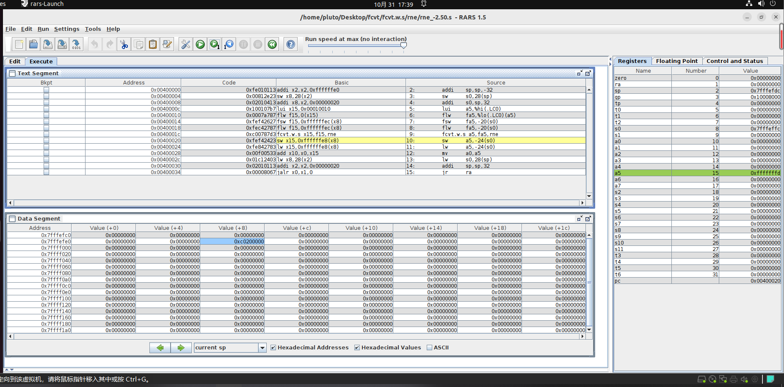    <br>    <div style="color:orange; border-bottom: 1px solid #d9d9d9;    display: inline-block;    color: #999;    padding: 2px;">RNE_-2.50</div> </center>

#### 5.1.2 RTZ -- Round towards Zero

##### 5.1.2.1 number -- 1.49	`0x3F BE B8 51`

<center>    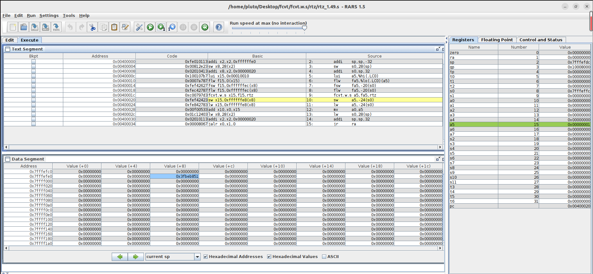    <br>    <div style="color:orange; border-bottom: 1px solid #d9d9d9;    display: inline-block;    color: #999;    padding: 2px;">RTZ_1.49</div> </center>

##### 5.1.2.2 number -- 1.50	`0b1.10`

<center>    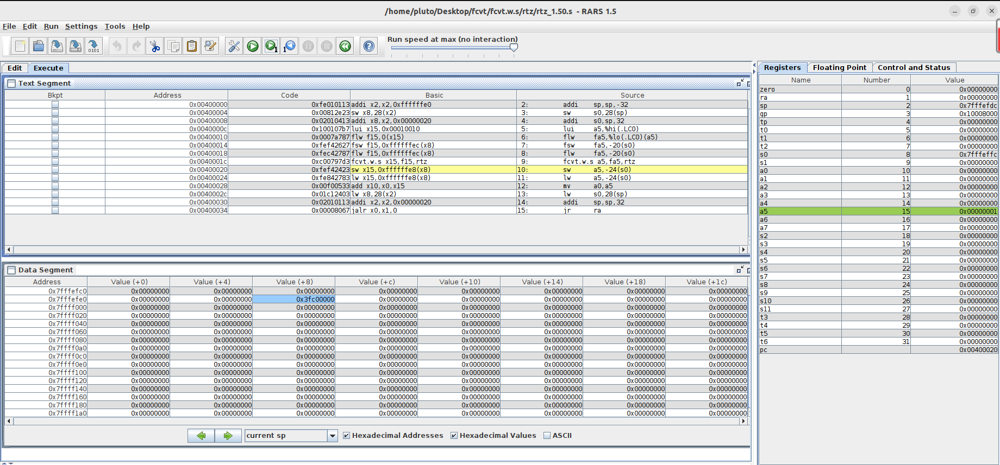    <br>    <div style="color:orange; border-bottom: 1px solid #d9d9d9;    display: inline-block;    color: #999;    padding: 2px;">RTZ_1.50</div> </center>

##### 5.1.2.3 number -- 1.51	`0x3F C1 47 AE`

<center>    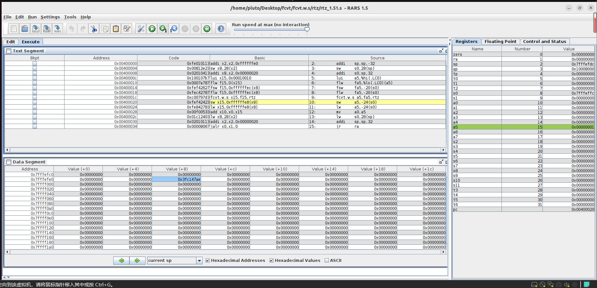    <br>    <div style="color:orange; border-bottom: 1px solid #d9d9d9;    display: inline-block;    color: #999;    padding: 2px;">RTZ_1.51</div> </center>

##### 5.1.2.4 number -- 10.50	`0b1010.10`

<center>    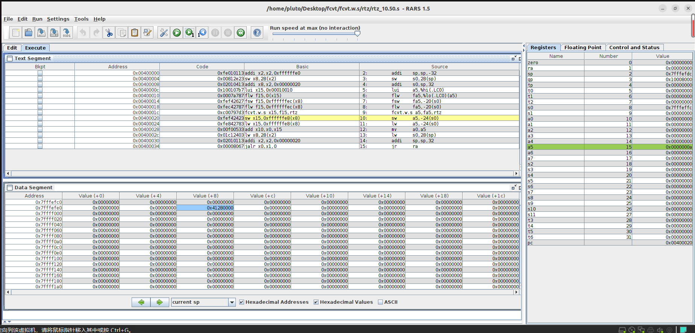    <br>    <div style="color:orange; border-bottom: 1px solid #d9d9d9;    display: inline-block;    color: #999;    padding: 2px;">RTZ_10.50</div> </center>

##### 5.1.2.5 number -- -1.50	`-0b1.10`

<center>    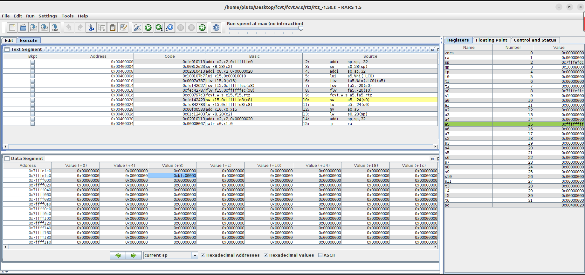    <br>    <div style="color:orange; border-bottom: 1px solid #d9d9d9;    display: inline-block;    color: #999;    padding: 2px;">RTZ_-1.50</div> </center>

##### 5.1.2.6 number -- -1.75	`-0b1.11`

<center>    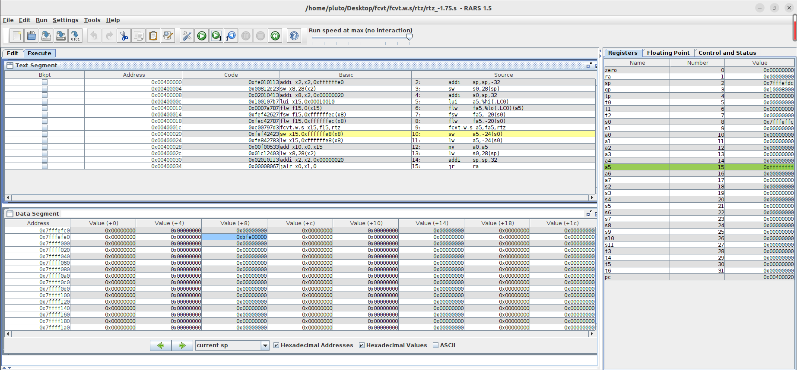    <br>    <div style="color:orange; border-bottom: 1px solid #d9d9d9;    display: inline-block;    color: #999;    padding: 2px;">RTZ_-1.75</div> </center>

由上面的用例可知，对于rtz类型，不管是整数还是负数，都只是将小数部分舍弃

#### 5.1.3 RDN -- Round Down (towards −∞)

##### 5.1.3.1 number -- 1.25	`0b1.01`

<center>    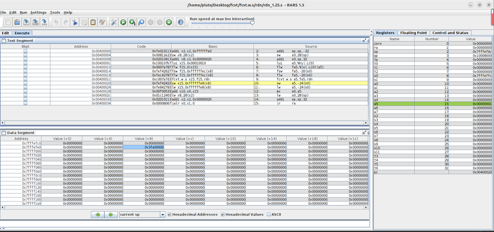    <br>    <div style="color:orange; border-bottom: 1px solid #d9d9d9;    display: inline-block;    color: #999;    padding: 2px;">RDN_1.25</div> </center>

##### 5.1.3.2 number -- 1.50	`0b1.10`

<center>    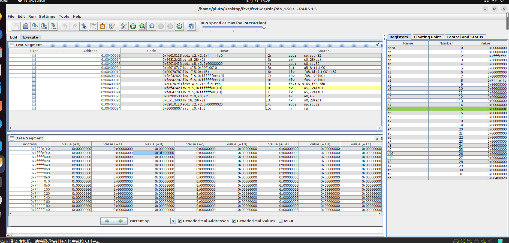    <br>    <div style="color:orange; border-bottom: 1px solid #d9d9d9;    display: inline-block;    color: #999;    padding: 2px;">RDN_1.50</div> </center>

##### 5.1.3.3 number -- 1.75	`0b1.11`

<center>    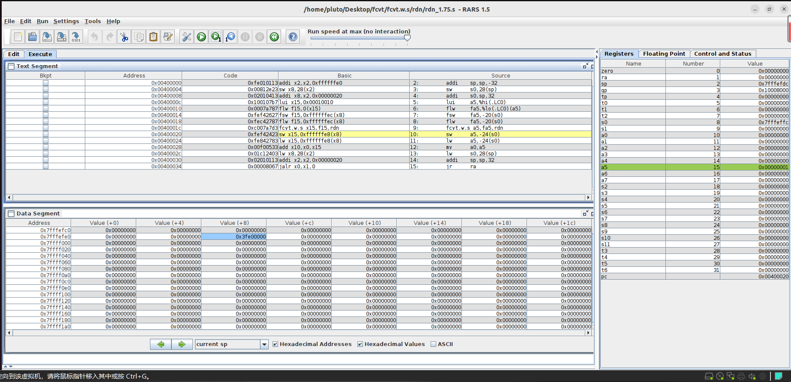    <br>    <div style="color:orange; border-bottom: 1px solid #d9d9d9;    display: inline-block;    color: #999;    padding: 2px;">RDN_1.75</div> </center>

##### 5.1.3.4 number -- -1.00	`-0b1.00`

<center>    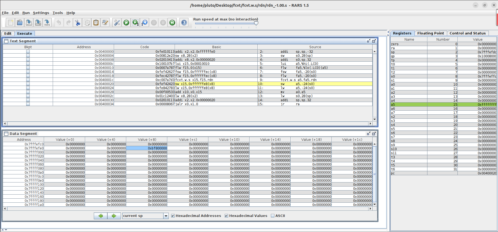    <br>    <div style="color:orange; border-bottom: 1px solid #d9d9d9;    display: inline-block;    color: #999;    padding: 2px;">RDN_-1.00</div> </center>

##### 5.1.3.5 number -- -1.25	`-0b1.01`

<center>    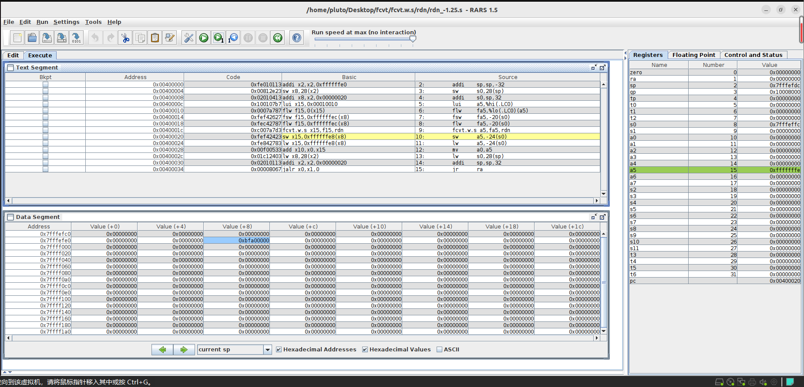    <br>    <div style="color:orange; border-bottom: 1px solid #d9d9d9;    display: inline-block;    color: #999;    padding: 2px;">RDN_-1.25</div> </center>

##### 5.1.3.6 number -- -1.50	`-0b1.1`

<center>    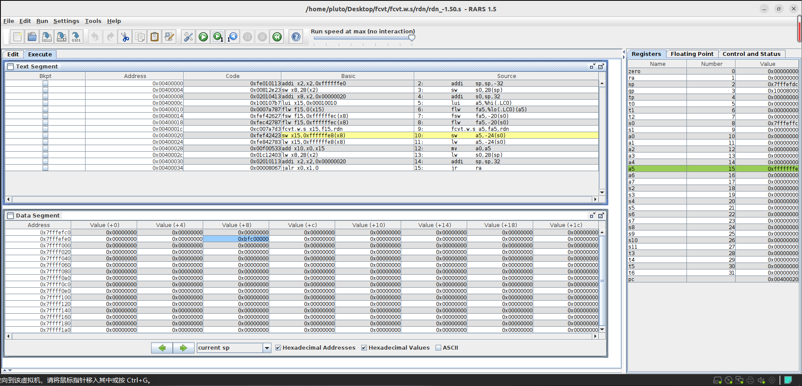    <br>    <div style="color:orange; border-bottom: 1px solid #d9d9d9;    display: inline-block;    color: #999;    padding: 2px;">RDN_1.50</div> </center>

由上述测试用例可知，对于正数，直接将小数部分舍去，对于负数，对于恰好为整数的，则直接取整数部分，对于不为整数的，整向下取整。实际上本中rounding方式就是进行向下取整函数。

<center>    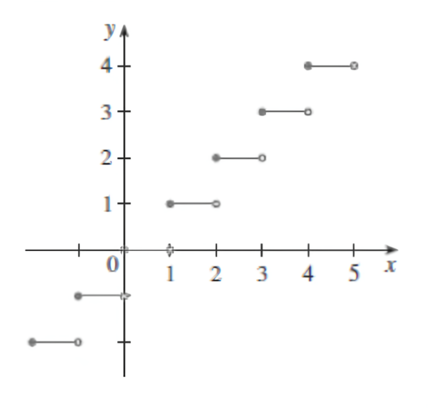    <br>    <div style="color:orange; border-bottom: 1px solid #d9d9d9;    display: inline-block;    color: #999;    padding: 2px;">RD function</div> </center>

#### 5.1.4 RUP -- Round Up (towards +∞)

##### 5.1.4.1 number -- -2.00	`-0b10.0`

<center>    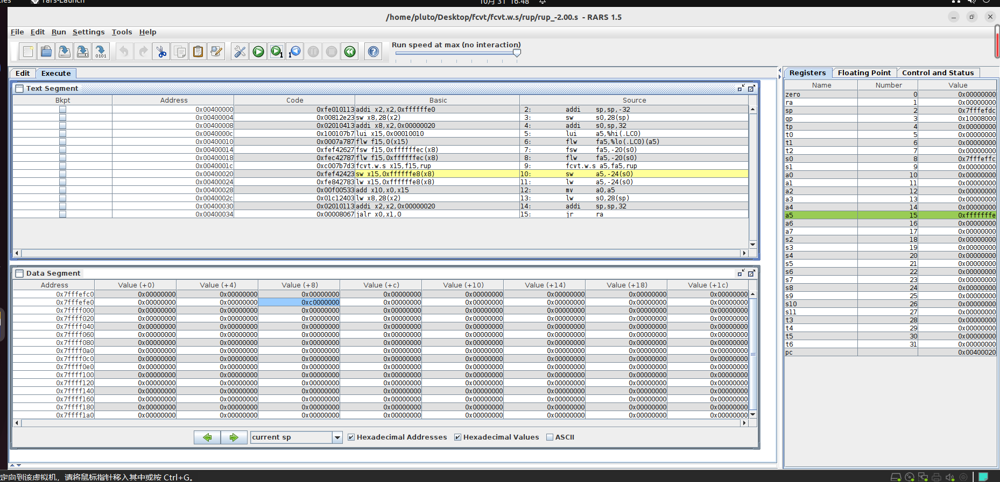    <br>    <div style="color:orange; border-bottom: 1px solid #d9d9d9;    display: inline-block;    color: #999;    padding: 2px;">RUP_-2.00</div> </center>

##### 5.1.4.2 number -- -1.50	`-0b1.10`

<center>    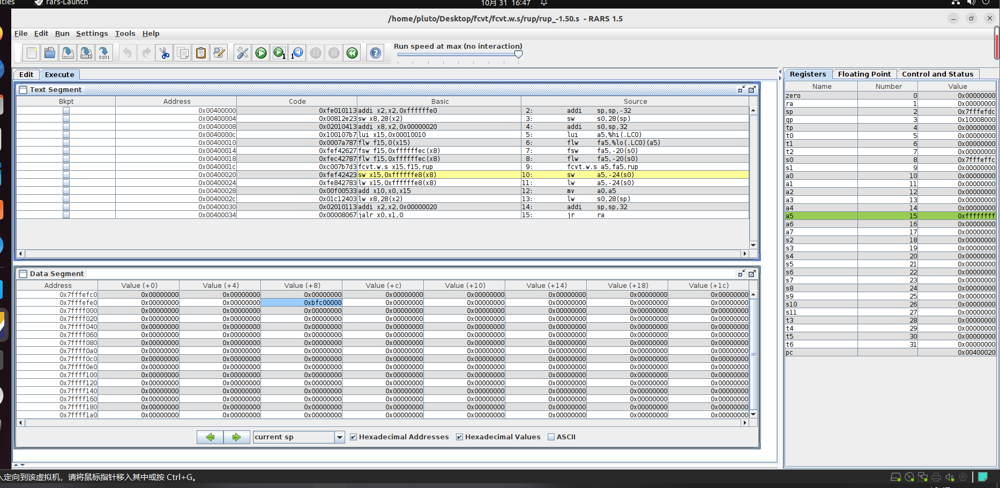    <br>    <div style="color:orange; border-bottom: 1px solid #d9d9d9;    display: inline-block;    color: #999;    padding: 2px;">RUP_-1.50</div> </center>

##### 5.1.4.3 number -- -1.00	`-0b1.0`

<center>    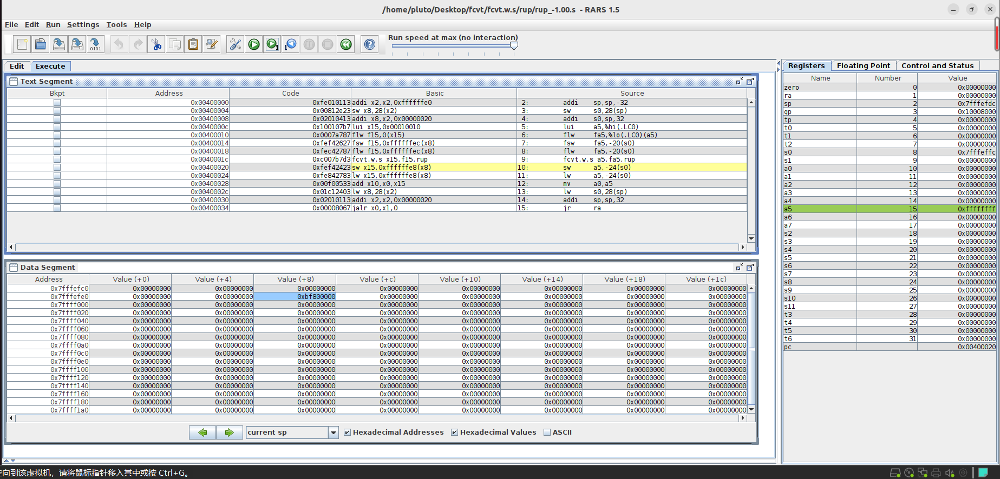    <br>    <div style="color:orange; border-bottom: 1px solid #d9d9d9;    display: inline-block;    color: #999;    padding: 2px;">RUP_-1.00</div> </center>

##### 5.1.4.4 number -- 0.00	`0b0.0`

<center>    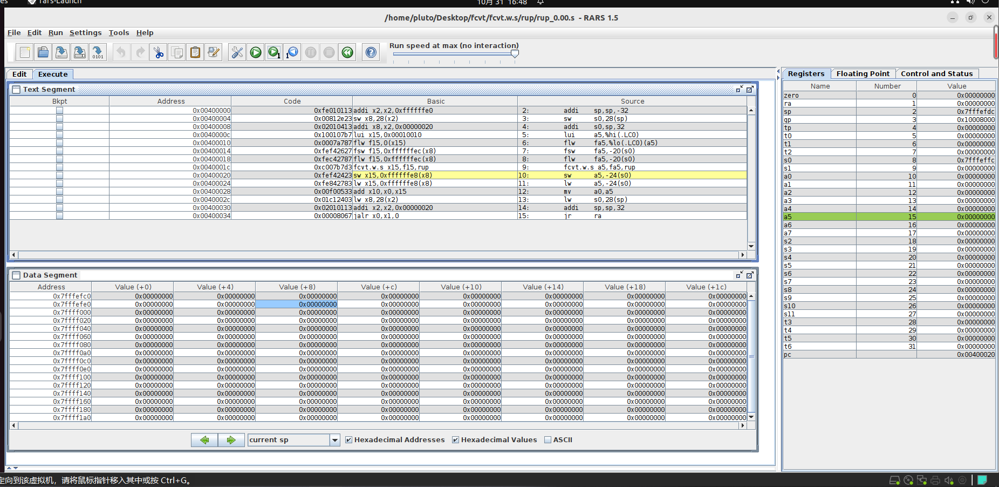    <br>    <div style="color:orange; border-bottom: 1px solid #d9d9d9;    display: inline-block;    color: #999;    padding: 2px;">RUP_0.00</div> </center>

##### 5.1.4.5 number -- 1.00	`0b1.0`

<center>    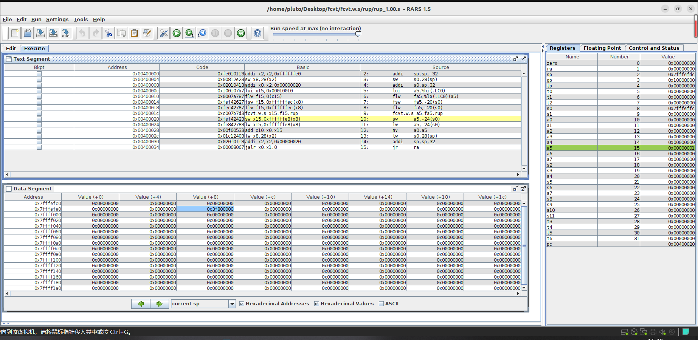    <br>    <div style="color:orange; border-bottom: 1px solid #d9d9d9;    display: inline-block;    color: #999;    padding: 2px;">RUP_1.00</div> </center>

##### 5.1.4.6 number -- 1.50	`0b1.10`

<center>    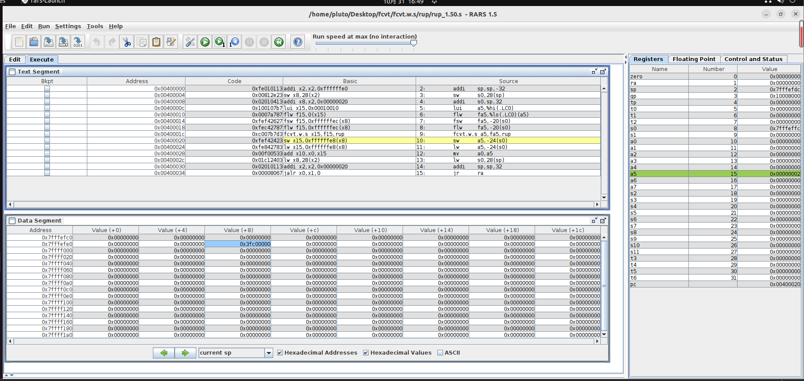    <br>    <div style="color:orange; border-bottom: 1px solid #d9d9d9;    display: inline-block;    color: #999;    padding: 2px;">RUP_1.50</div> </center>

##### 5.1.4.7 number -- 2.00	`0b10.0`

<center>    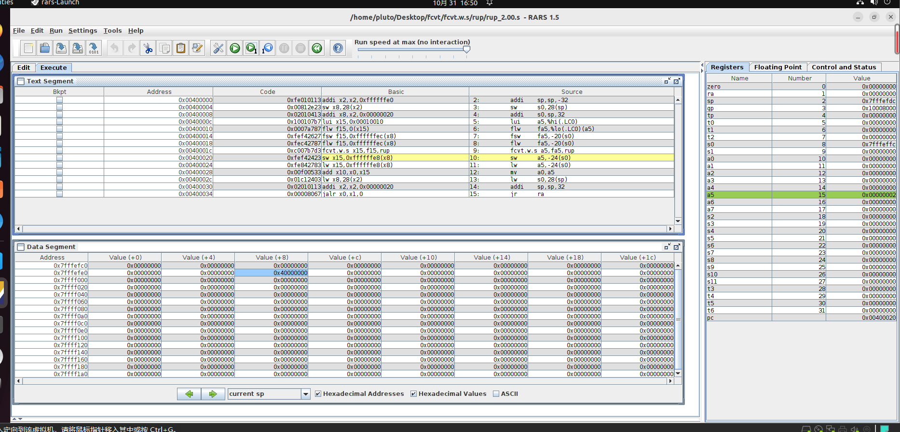    <br>    <div style="color:orange; border-bottom: 1px solid #d9d9d9;    display: inline-block;    color: #999;    padding: 2px;">RUP_2.00</div> </center>

由上述测试可知，在RUP状态下，对于负数，直接舍弃小数部分，对于正数，如果恰好为整数，则直接去掉小数部分作为结果，如果为小数，则向上进一。实际上为向上取整函数

<center>    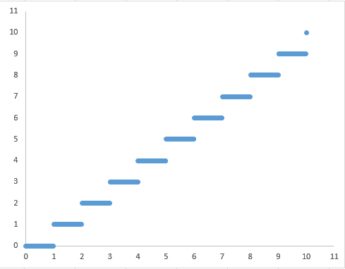    <br>    <div style="color:orange; border-bottom: 1px solid #d9d9d9;    display: inline-block;    color: #999;    padding: 2px;">RUP function</div> </center>

#### 5.1.5 RMM -- Round to Nearest, ties to Max Magnitude

##### 5.1.5.1 number -- 1.49	`0x3F BE B8 51`

<center>    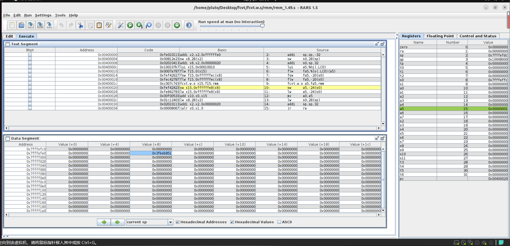    <br>    <div style="color:orange; border-bottom: 1px solid #d9d9d9;    display: inline-block;    color: #999;    padding: 2px;">RMM_1.49</div> </center>

##### 5.1.5.2 number -- 1.50	`0b1.10`

<center>    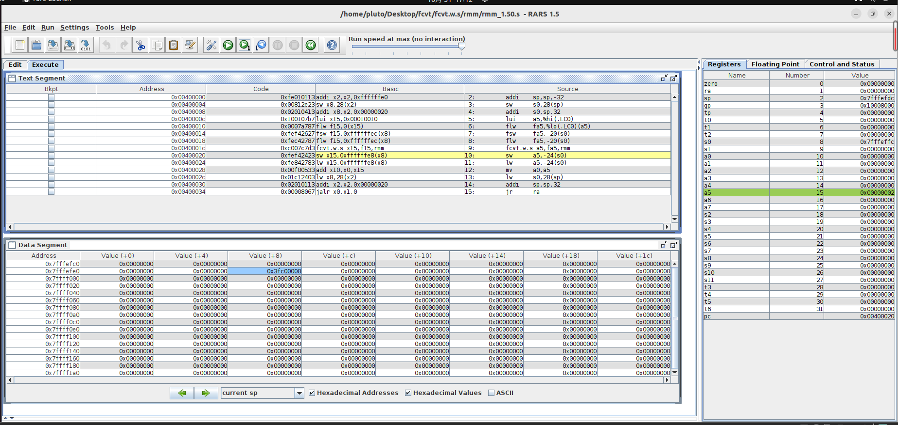    <br>    <div style="color:orange; border-bottom: 1px solid #d9d9d9;    display: inline-block;    color: #999;    padding: 2px;">RMM_1.50</div> </center>

##### 5.1.5.3 number -- 1.51	`0x3F C1 47 AE`

<center>    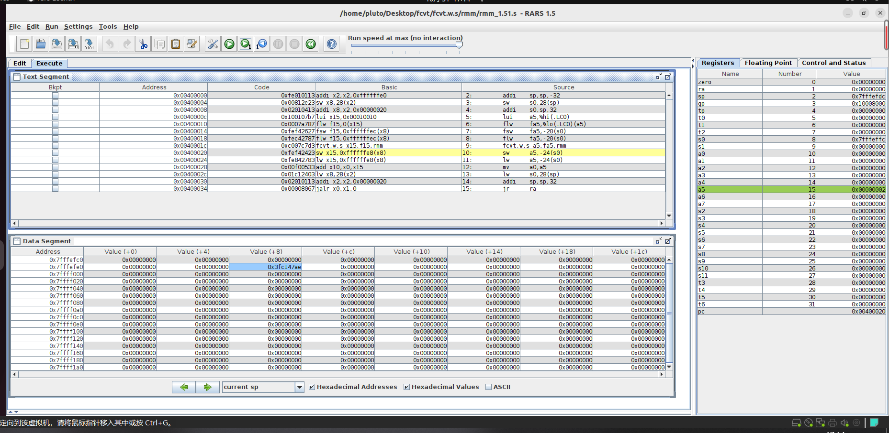    <br>    <div style="color:orange; border-bottom: 1px solid #d9d9d9;    display: inline-block;    color: #999;    padding: 2px;">RMM_1.51</div> </center>

##### 5.1.5.4 number -- 2.50	`0b10.10`

<center>    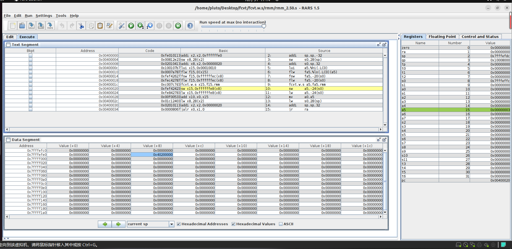    <br>    <div style="color:orange; border-bottom: 1px solid #d9d9d9;    display: inline-block;    color: #999;    padding: 2px;">RMM_2.50</div> </center>

##### 5.1.5.5 number -- 3.50	`0b11.10`

<center>    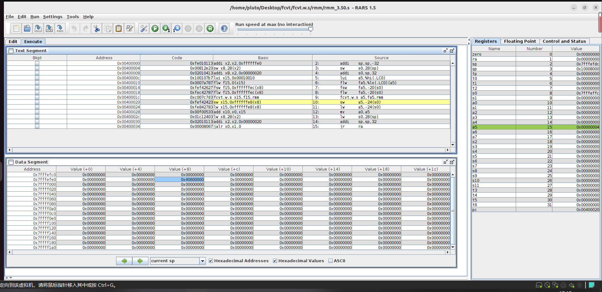    <br>    <div style="color:orange; border-bottom: 1px solid #d9d9d9;    display: inline-block;    color: #999;    padding: 2px;">RMM_3.50</div> </center>

##### 5.1.5.6 number -- -1.49	`-0x3F BE B8 51`

<center>        <br>    <div style="color:orange; border-bottom: 1px solid #d9d9d9;    display: inline-block;    color: #999;    padding: 2px;">RMM_-1.49</div> </center>

##### 5.1.5.7 number -- -1.50	`-0b1.10`

<center>    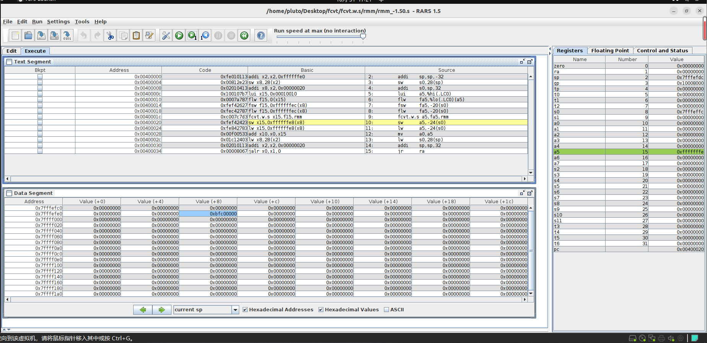    <br>    <div style="color:orange; border-bottom: 1px solid #d9d9d9;    display: inline-block;    color: #999;    padding: 2px;">RMM_-1.50</div> </center>

##### 5.1.5.8 number -- -1.51	`-0x3F C1 47 AE`

<center>    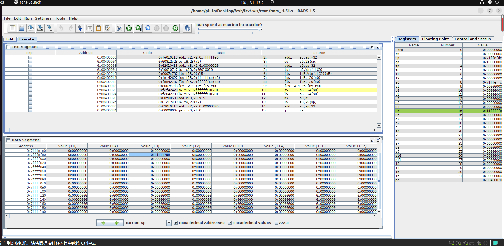    <br>    <div style="color:orange; border-bottom: 1px solid #d9d9d9;    display: inline-block;    color: #999;    padding: 2px;">RMM_-1.51</div> </center>

#### 5.1.6 DYN -- In instruction’s rm field, selects dynamic rounding mode

由于在动态模式下，rounding mode取决于fcsr中的frm filed，由于frm filed设置为000，因此这一部分结果与RNE部分相同，因此不在此处进行展示，如需要观察实验结果可以到相关文件夹进行查看。

### 5.2 fcvt.w.s测试

#### 5.2.1 number -- $2^{25}$

<center>    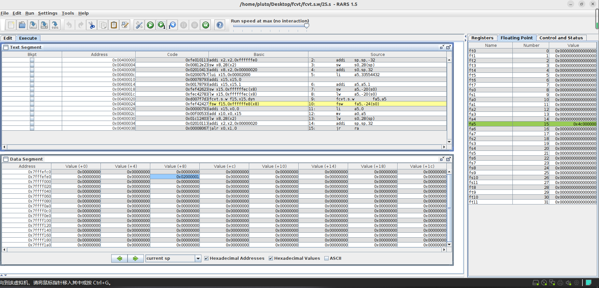    <br>    <div style="color:orange; border-bottom: 1px solid #d9d9d9;    display: inline-block;    color: #999;    padding: 2px;">2<sup>25</sup></div> </center>

#### 5.2.1 number -- $2^{25}+1$

<center>        <br>    <div style="color:orange; border-bottom: 1px solid #d9d9d9;    display: inline-block;    color: #999;    padding: 2px;">2<sup>25</sup>+1</div> </center>

#### 5.2.1 number -- $2^{25}+2$

<center>    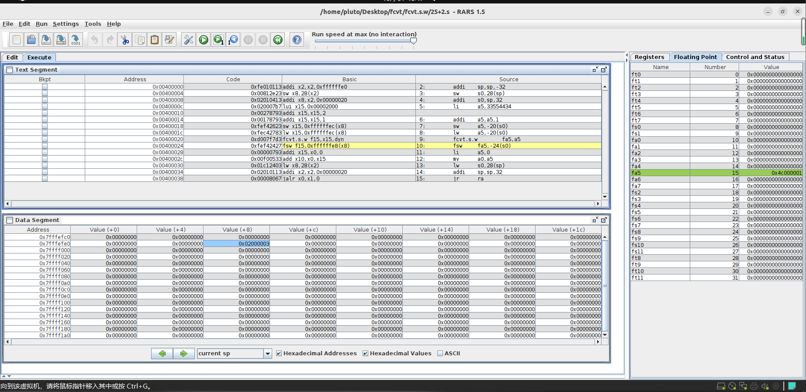    <br>    <div style="color:orange; border-bottom: 1px solid #d9d9d9;    display: inline-block;    color: #999;    padding: 2px;">2<sup>25</sup>+2</div> </center>

#### 5.2.1 number -- $2^{25}+3$

<center>        <br>    <div style="color:orange; border-bottom: 1px solid #d9d9d9;    display: inline-block;    color: #999;    padding: 2px;">2<sup>25</sup>+3</div> </center>

#### 5.2.1 number -- $2^{25}+4$

<center>    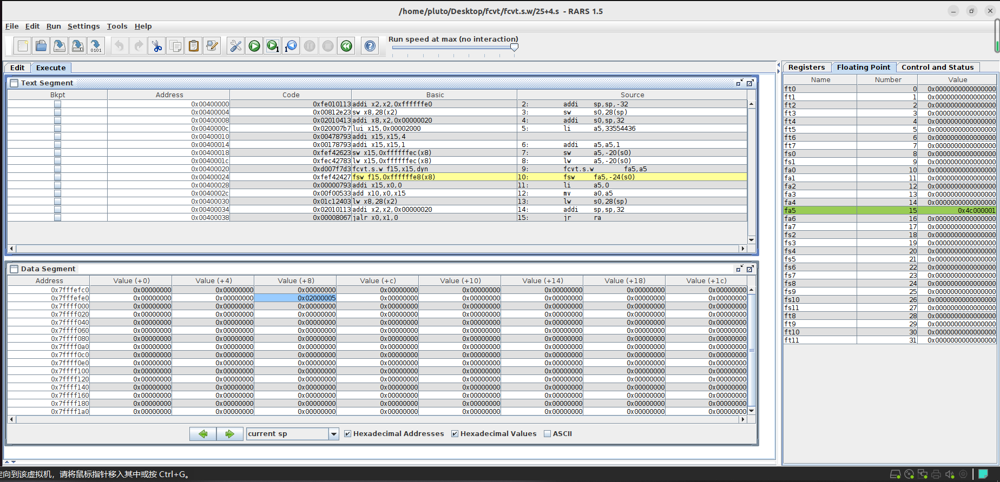    <br>    <div style="color:orange; border-bottom: 1px solid #d9d9d9;    display: inline-block;    color: #999;    padding: 2px;">2<sup>25</sup>+4</div> </center>

## 六. 实验结果分析(效果分析)

1. 第一部分`fcvt.w.s`的分析

   1. RNE -- 000，关于RNE，有部分测试用例与理论不符合，1.5在rounding之后为2，这是正常的，因为在两边都相等的时候需要rounding到偶数的那一边，但是2.5在rounding之后为3，这与理论不符合，理论上来说应该rounding到2。对于这一问题，我认为是因为在实现这一模拟器没有充分考虑，直接使用了四舍五入！
   2. RTZ -- 001，这一部分的测试没有问题，这也是相对来说比较容易实现的一部分
   3. RDN -- 010，这种round实际上就是使用向下取整函数，在测试中，正数的测试用例全部都为舍弃小数部分，而负数部分，若为整数则不变，若为小数则向下取整。
   4. RUP -- 011， 这种round实际上就是使用向上取整函数，在测试中，负数的测试用例全部都为舍弃小数部分，而正数部分，若为整数则不变，若为小数则向上取整。
   5. RMM -- 100， 这一rounding的测试中同样发现了问题，对于正数部分没有问题，先是round到更近的一边，若相等则取更大的。对于负数的一般用例如-1.49，-1.51都为正常，但是对于-1.5，按照理论应该round到-1，但是测试中则是round到了-2。对于这一错误，我同样认为是在实现模拟器的时候没有认真考虑。
   6. DYN -- 111， 这一部分在测试中由于fcsr的frm设置为000，因此与RNE结果相同。

2. 第二部分`fcvt.s.w`的分析

   测试的结果证明我的猜测是正确的。通过测试结果我们可以推断出，对于无法精确表示的数，转化为浮点数的过程如下

   > 1. 将32位2进制数取出，记录最高的为1的位的index为i
   > 2. 如果i小于24则可以表示，直接转化，否则进入第3步
   > 3. 按照rm filed从i-23位进行round

   对于下图，首先由于i大于24，因此需要round，默认的round位DYN，同时fcsr的frm为000，因此进行RNE。对于需要被round的部分，如果第一位为0，则直接舍去，如果第一位为1，则向前进位（实际上在第1位为1且后面皆为0时，还需要判断前面的是否为偶数，但是由于本模拟器对于RNE实现错误，因此按照模拟器的实现是正确的）

<center>    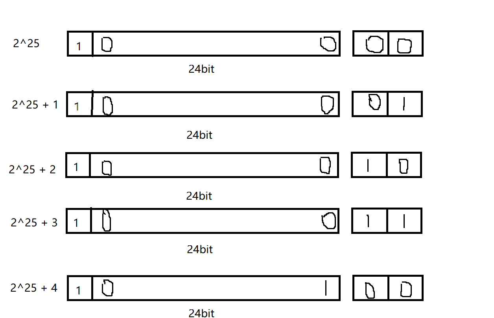    <br>    <div style="color:orange; border-bottom: 1px solid #d9d9d9;    display: inline-block;    color: #999;    padding: 2px;">int to floating-point</div> </center>

## 七. 实验体会

1. 首先本次实验选题的过程占用了极长的时间，出现这一问题的原因主要是因为对于相关指令并不算熟悉的原因，一直觉得这个不合适那个不合适，但是直到我真正开始着手做，才发现原来即使这样一条数据类型转化指令里面同样有很多可以挖掘的地方。
2. 还记得老师在初讲这个探索实验时，谈到了结合之前学过的知识进行融会贯通，在这一实验中我充分体会到了这一点！！起初我在选择整型与浮点型转化的时候还觉得这个指令可能并不能做的很深入，而且我最开初关注的点为浮点到整型。但是，当我反过来想从整型到浮点型会出现什么问题时，那一瞬间，就像一束光一闪而现，我想到，在我们之前学习计组的时候再将浮点数的时候讲到过浮点数表示的缺陷，就是在数逐渐增大的时候，能够是的数据会逐渐稀疏，进而里面有些整数是无法表示的。那么我立刻想到，如果一个整数恰好在浮点数无法表示的位置，会发生什么情况呢？这种情况下处理器会怎么尽量减小误差呢？然后我继续推测，对于无法表示的数，当我们将指数提出来之后，剩下的其实就是一个小数部分大于23位的数，因此这同样是一个round问题，只不过从round到整数变为round到小数的第23位。后续的实验测试也证实了我的猜测。这个过程让我真正体会到了老师所说的融会贯通的感觉，虽然我离融会贯通还有很远的距离。但是这个过程确实也极大地增强了我的信心hhh，这可以说是我在做这个实验的过程中收获最大的一点了。
3. 在这个实验中需要用到各种工具，这个过程其实同样也是很重要的，只有工具找好了，实验做起来才会顺畅。说起来，其实我的工具找得并不算好，甚至实现和理论出现了冲突（但是我找的时候也不知道它会有这样的问题T_T)。但是换个角度说，也是一个不错的经历，这个故事告诉我们千万不要盲目地相信其他人做的工具或者书本，因为他们都是人做出来的，也不一定是完美的。在我今后的学习过程中，我也会秉持这种精神，像IceFrog修dota的bug一样，不断地修正不管是我的还是其他人做的工具中的问题。
4. 对于测试的过程，实际上是一个极为痛苦的过程，最难的地方就是在这个过程会比较枯燥，面对着众多的数据，需要一一把他们捋清楚并归类，收集完实验数据之后，还要一一进行验证，因为程序完全有可能有bug。测试占据的我实验报告的大部分，同时也占据了我做实验的大头。要将这个过程做好需要有一个比较平和沉着的心境，惭愧的是我并没有，期间一度想要摆烂，虽然最后还是跌跌撞撞地做完了，但是我的心性可能还需要进一步的锤炼。另一个方面就是关于实验测试用例的问题，实际上这并不是我第一次写实验用例，但是却跟我第一次写的测试用例的水平没有什么区别。说明在之前的学习过程中，我往往忽略了测试用例这一个极为重要的部分。其实随着学习的不断深入，我已经越来越意识到实验测试的重要性，写出来一个程序并不难，难的是要写出一个没有bug的程序，这个过程就需要良好的测试用例来协助，通过测试进行反馈，然后进一步修正bug。在我自行进行一些网上的优秀资源进行学习时，他们往往会提供极为完备的测试用例，有的甚至多达几千行，有的甚至测试用例本身就可以成为一个优秀的项目了。这更加说明了测试用例的重要性，希望之后能不断训练，进而写出更好的测试用例吧。
5. 这一次另一个让我很震撼的地方是，真的是每一条指令都有可以探索的地方。就像我最开始了解的x86的INT指令，riscv的ecall指令等等，这些指令里面包含着很多设计的深意，对于INT的指令，我之前只觉得它是一个产生中断的指令，但是进一步了解了之后，发现原来中断还分为mask与unmask，即使是软件层面调用INT同样有讲究。对于ecall，在操作系统中有过了解，只知道它是进行系统调用，但是对于这个过程中的细节并不了解，在查找资料之后才知道，原来这一条指令就涉及到多个寄存器以及跳转的操作，还包括csr寄存器的操作。这也让我再次认识到，计算机是一个极为复杂的系统，其中的每一部分组合起来的复杂度太高，需要将一个一个模块进行抽象(abstraction 我认为计算机最重要的概念)，当每一部分都保证能够正常工作，组合起来新的抽象，抽象这一概念几乎在每一门课中都有所体现。

## 八. 经验教训

1. 首先一个就是尽早确定方向，不然会既费时间又无效，我在前期的过程中不断犹豫到底选哪一个？正是这种犹豫，导致我后期的时间比较吃紧，没能进行更加好的，进一步的实验探索。因此，当断则断，否则就会反受其乱
2. 希望能有更多质疑的精神，在这次的实验中，我因为实验的测试结果与理论不符，想了好久，几乎把实验的所有过程都检查了一遍，不知道检查了多少次数据，都没有发现问题。最后才转到怀疑实验工具的问题上。
3. 学会将知识进行结合，以前往往知识和实践有所脱节，比如说在数据结构的课程上学到了那么多的数据结构和算法，了解了他们各自的优点和缺点。但是到了真正需要解决问题的时候，却不知道究竟要选择哪种，往往是稀里糊涂就上了，也没有进行需求的分析。这次的实验中，我真正体会到了将知识运用于实际的快乐，真的超级激动！希望后面还能继续保持。
4. 关于测试用例的问题，其实上面已经谈到过了，但是由于它的重要性，谈两遍并不过分。第六部分已经说了我不太会写，那么我希望我后面能够多看别人怎么写的测试用例，总结写测试用例的规律（比如从一般情况到特殊情况）。
5. 还有比较惨痛的教训，不要拖ddl！不要拖ddl！不要拖ddl！其实我到测试用例还有很多的时间，但是由于后面一直拖以及其他事情开始堆积，导致最后的部分有些赶，希望能更有行动力下次。

## 九. 参考文献

[1] Computer Organization and Design The Hardware Software Interface （RISC-V Edition） David A. Patterson, John L. Hennessy

[2] University of California, Berkeley CS61C 20-su Lec5

[3] riscv-spec-20191213 Andrew Waterman, Krste Asanovi


